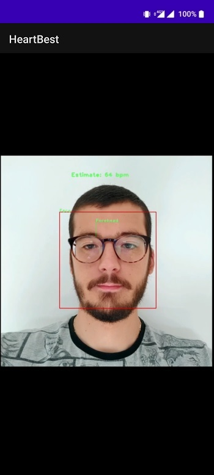

# HeartBest
Android heart rate monitor.

# Screenshots

**Video demonstration [here](screenshots)**

## Dependencies

| Tool      | Version |
| ---       |  ---    |
| [OpenCV](https://opencv.org/releases/) | 4.5.2
| [Android Studio](https://developer.android.com/studio) | 4.2
| [Android Build Tools](https://developer.android.com/studio/releases/build-tools) | 30.0.2
| [Android NDK](https://developer.android.com/ndk/guides) | r21d
| [Kotlin](https://kotlinlang.org/docs/android-overview.html) | 1.5.0
| [Gradle](https://gradle.org/) | 6.7.1

## How To Use

1. Download and Install Android Studio.

2. Install NDK, CMake and LLDB.

3. Clone this repository as an Android Studio project :
    * In Android Studio, click on `File -> New -> Project from Version Control -> Git`
    * Paste this repository *Github URL*, choose a *project directory* and click next.

4. Install *OpenCV Android release* :
    * Download OpenCV 4.5.2 Android release.
    * Unzip downloaded file and put **OpenCV-android-sdk** directory on a path of your choice.

5. Link your *Android Studio* project to the *OpenCV Android SDK* you just downloaded :
    * Open [gradle.properties](gradle.properties) file and edit following line with your own *OpenCV Android SDK* directory path :

          opencvsdk=C\:/Users/Example/Downloads/OpenCV-android-sdk

6. Sync Gradle and run the application on your Android Device!

## NOTE

[CameraActivity.java](opencv/java/src/org/opencv/android/CameraActivity.java) in opencv module has been changed for better compatibility.

######  Changes

public class CameraActivity extends ~~Activity~~ {

public class CameraActivity extends **AppCompatActivity** {
